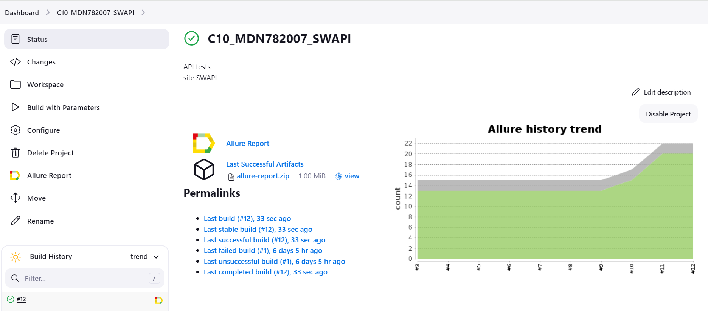
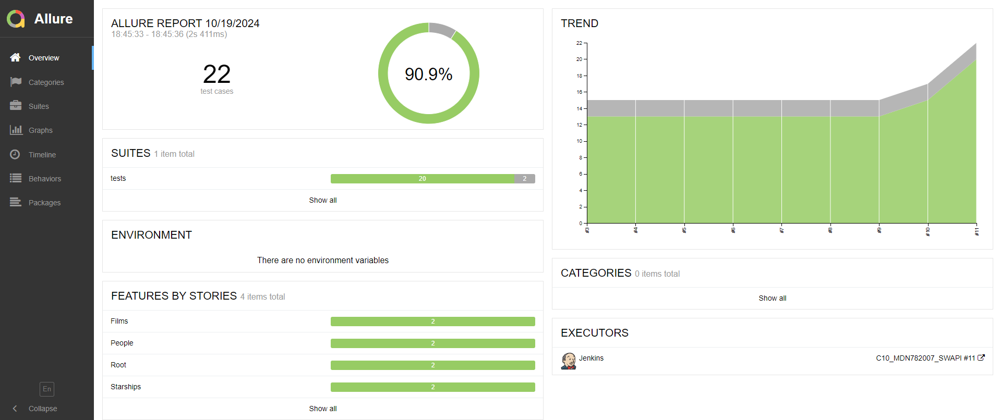
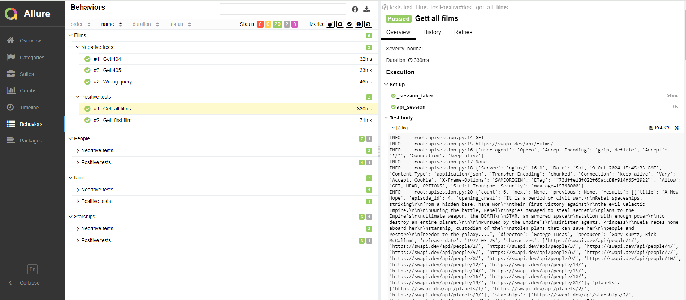

## Test project. API test - Star Wars API

[site SWAPI](https://swapi.dev/)

#### Tests, positive and negative:

1) People

- [x] Get people's list
- [x] Search people
- [x] Get first people
- [x] Get first people
- [x] without user agent

#### Для запуска автотестов в Jenkins

1. Открыть <a target="_blank" href="https://jenkins.autotests.cloud/job/C10_MDN782007_SWAPI/">проект</a>
2. Выбрать пункт `Build with Parameters`
3. Указать комментарий для уведомления в Телеграмм "COMMENT"
4. Указать сборку `ENVIRONMENT` по умолчанию "PROD"
5. Нажать кнопку `Build`
6. Результат запуска сборки можно посмотреть в отчёте Allure

----

### Allure отчет

Отчет позволяет получить детальную информацию по все шагам тестов, включая скриншоты и log - файлы

  